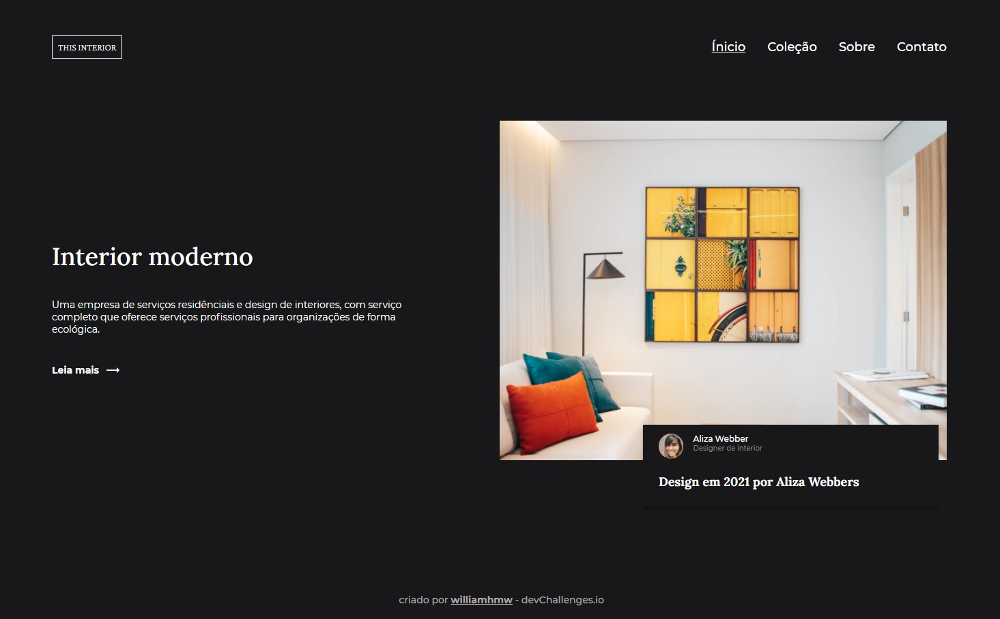

<!-- Please update value in the {}  -->

<h1 align="center">Interior consultant</h1>

   Solution for a challenge from  <a href="http://devchallenges.io" target="_blank">Devchallenges.io</a>.

  <h3>
    <a href="https://williamhmw.github.io/interior-consultant/">
      Demo
    </a>
     | 
    <a href="https://github.com/williamhmw/interior-consultant">
      Solution
    </a>
     | 
    <a href="https://devchallenges.io/challenges/Jymh2b2FyebRTUljkNcb">
      Challenge
    </a>
  </h3>

<!-- TABLE OF CONTENTS -->

## Table of Contents

- [Introdução](#introdução)
  - [Feito com](#feito-com)
- [Recursos](#recursos)
- [Contato](#contact)

<!-- OVERVIEW -->

## Introdução

Nesse projeto utilzei HTML para fazer a marcação da página e o CSS para estilizar todo o conteúdo.

O menu mobile foi feito com CSS e HTML, o efeito para mostrar e esconder o conteúdo foi utilizado Javascript.

Na construção do projeto foi utilizado alguns recursos de flexbox e grid em CSS, para o menu foi utilizado o 'for' e 'functions'.

Para acessar a demo basta cliccar no link acima em "Demo".

### Feito com

<!-- This section should list any major frameworks that you built your project using. Here are a few examples.-->

- [HTML](https://developer.mozilla.org/en-US/docs/Web/HTML)
- [CSS](https://developer.mozilla.org/en-US/docs/Web/CSS)
- [JS](https://developer.mozilla.org/en-US/docs/Web/JavaScript)

## Recursos

<!-- List the features of your application or follow the template. Don't share the figma file here :) -->

Este site foi criado como um envio para um desafio [DevChallenges](https://devchallenges.io/challenges) . O [desafio](https://devchallenges.io/challenges/Jymh2b2FyebRTUljkNcb) era construir um site para completar as histórias de usuário fornecidas.

## Contato

- GitHub [@williamhmw]https://github.com/williamhmw)
- Linkedin [@william-honorio-m](https://www.linkedin.com/in/william-honorio-m/)